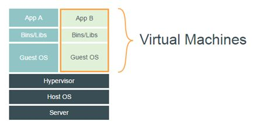
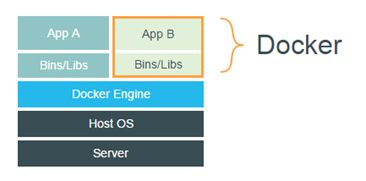

# Introdução ao Docker

> Baseado em [https://docs.docker.com/get-started/overview/](https://docs.docker.com/get-started/overview/)

> [Cheat Sheet 1](https://www.docker.com/sites/default/files/d8/2019-09/docker-cheat-sheet.pdf)

> [Cheat Sheet 2](https://dockerlabs.collabnix.com/docker/cheatsheet/)

## Visão geral

Docker é uma plataforma aberta para desenvolvimento, implantação e execução de aplicativos. O Docker permite que você separe seus aplicativos de sua infraestrutura para que possa entregar o software rapidamente. Com o Docker, você pode gerenciar sua infraestrutura da mesma forma que gerencia seus aplicativos. Tirando proveito das metodologias do Docker para implantar, testar e implantar código rapidamente, você pode reduzir significativamente o atraso entre a escrita do código e sua execução na produção. (**Lead Time**).

## A plataforma Docker

O Docker oferece a capacidade de empacotar e executar um aplicativo em um ambiente isolado denominado contêiner. O isolamento e a segurança permitem que você execute vários contêineres simultaneamente em um determinado host. Os contêineres são leves porque não precisam da carga extra de um hipervisor, mas são executados diretamente no kernel da máquina host. Isso significa que você pode executar mais contêineres em uma determinada combinação de hardware do que se estivesse usando máquinas virtuais. Você pode até mesmo executar contêineres Docker em máquinas host que são na verdade máquinas virtuais!

O Docker fornece ferramentas e uma plataforma para gerenciar o ciclo de vida de seus contêineres:

- Desenvolva seu aplicativo e seus componentes de suporte usando contêineres;
- O contêiner se torna a unidade para distribuição e teste de seu aplicativo;
- Quando estiver pronto, implante seu aplicativo em seu ambiente de produção, como um contêiner ou um serviço orquestrado. Isso funciona da mesma forma, quer seu ambiente de produção seja um data center local, um provedor de nuvem ou um híbrido dos dois.

## Docker Engine

O **Docker Engine** é um aplicativo cliente-servidor com estes componentes principais:

- Um servidor que é um tipo de programa de longa duração denominado processo **daemon** (o comando `dockerd`).

- Uma API REST que especifica interfaces que os programas podem usar para falar com o daemon e instruí-lo sobre o que fazer;

- Um cliente de interface de linha de comando (CLI) (o comando **docker**);


O CLI usa a API REST do Docker para controlar ou interagir com o daemon Docker por meio de scripts ou comandos CLI diretos.

O daemon cria e gerencia objetos Docker , como imagens, contêineres, redes e volumes.

## Arquitetura Docker

Docker usa uma arquitetura cliente-servidor. O cliente Docker se comunica com o daemon Docker, que faz o trabalho pesado de construção, execução e distribuição de seus contêineres Docker. O cliente Docker e o daemon podem ser executados no mesmo sistema ou você pode conectar um cliente Docker a um daemon remoto do Docker. O cliente Docker e o daemon se comunicam usando uma API REST, por soquetes UNIX ou uma interface de rede.


### O daemon Docker

O Docker daemon (`dockerd`) escuta as solicitações da API Docker e gerencia objetos Docker, como imagens, contêineres, redes e volumes. Um daemon também pode se comunicar com outros daemons para gerenciar os serviços Docker.

## O cliente Docker

O cliente Docker (`docker`) é a principal maneira pela qual muitos usuários do Docker interagem com o Docker. Quando você usa comandos como `docker run`, o cliente envia esses comandos para `dockerd`, que os executa. O comando `docker` usa a API Docker. O cliente Docker pode se comunicar com mais de um daemon.

## Registros Docker

Um *registro* Docker armazena imagens Docker. O Docker Hub é um registro público que qualquer pessoa pode usar e o Docker está configurado para procurar imagens no Docker Hub por padrão. Você pode até executar seu próprio registro privado.

Quando você usa os comandos `docker pull` ou `docker run`, as imagens necessárias são baixadas do registro que estiver configurado. Quando você usa o comando `docker push`, sua imagem é enviada para o registro configurado.

## Objetos Docker

Ao usar o Docker, você está criando e usando imagens, contêineres, redes, volumes, plug-ins e outros objetos. Esta seção é uma breve visão geral de alguns desses objetos.

### IMAGENS

Uma imagem é um modelo somente leitura com instruções para criar um contêiner Docker. Freqüentemente, uma imagem é baseada em outra imagem, com alguma personalização adicional. Por exemplo, você pode construir uma imagem que é baseada na imagem ubuntu, mas instala o servidor web Apache e seu aplicativo, bem como os detalhes de configuração necessários para fazer seu aplicativo funcionar.

Você pode criar suas próprias imagens ou usar apenas aquelas criadas por terceiros e publicadas em um registro. Para construir sua própria imagem, você cria um *Dockerfile* com uma sintaxe simples para definir as etapas necessárias para criar a imagem e executá-la. Cada instrução em um Dockerfile cria uma camada na imagem. Quando você altera o Dockerfile e reconstrói a imagem, apenas as camadas que foram alteradas são reconstruídas. Isso é parte do que torna as imagens tão leves, pequenas e rápidas, quando comparadas a outras tecnologias de virtualização.

### CONTAINERS

Um contêiner é uma instância executável de uma imagem. Você pode criar, iniciar, parar, mover ou excluir um contêiner usando a API Docker ou CLI. Você pode conectar um contêiner a uma ou mais redes, anexar armazenamento a ele ou até mesmo criar uma nova imagem com base em seu estado atual.

Por padrão, um contêiner está relativamente bem isolado de outros contêineres e de sua máquina host. Você pode controlar o quão isolados estão a rede, o armazenamento ou outros subsistemas subjacentes de um contêiner de outros contêineres ou da máquina host.

Um contêiner é definido por sua imagem, bem como por quaisquer opções de configuração fornecidas a ele ao criá-lo ou iniciá-lo. Quando um contêiner é removido, todas as alterações em seu estado que não são armazenadas no armazenamento persistente desaparecem.

#### Comando de exemplo: `docker run`

O comando a seguir executa um contêiner ubuntu, conecta-se interativamente à sua sessão de linha de comando local e executa `/bin/bash`.

```bash
docker run -i -t ubuntu /bin/bash
```

Quando você executa este comando, acontece o seguinte (supondo que você esteja usando a configuração de registro padrão):

1. Se você não tiver a imagem ubuntu localmente, o Docker a puxará do registro configurado, como se você tivesse executado `docker pull ubuntu` manualmente.

2. O Docker cria um novo contêiner, como se você tivesse executado um comando `docker container create` manualmente.

3. O Docker aloca um sistema de arquivos de leitura e gravação para o contêiner, como sua camada final. Isso permite que um contêiner em execução crie ou modifique arquivos e diretórios em seu sistema de arquivos local.

4. O Docker cria uma interface de rede para conectar o contêiner à rede padrão, uma vez que você não especificou nenhuma opção de rede. Isso inclui a atribuição de um endereço IP ao contêiner. Por padrão, os contêineres podem se conectar a redes externas usando a conexão de rede da máquina host.

5. Docker inicia o contêiner e executa `/bin/bash`. Como o contêiner está sendo executado interativamente e conectado ao seu terminal (devido aos sinalizadores `-i` e `-t`), você pode fornecer entrada usando o teclado enquanto a saída é registrada em seu terminal.

6. Quando você digita `exit` para encerrar o comando `/bin/bash`, o contêiner para, mas não é removido. Você pode reiniciá-lo ou removê-lo.


### HYPERVISORS VS CONTAINERS





## A tecnologia subjacente

O Docker foi escrito na linguagem de programação Go e aproveita vários recursos do kernel do Linux para fornecer sua funcionalidade.

### Namespaces

O Docker usa uma tecnologia chamada `namespaces` para fornecer o espaço de trabalho isolado chamado de *contêiner*. Quando você executa um contêiner, o Docker cria um conjunto de *namespaces* para esse contêiner.

Esses namespaces fornecem uma camada de isolamento. Cada aspecto de um contêiner é executado em um namespace separado e seu acesso é limitado a esse namespace.

O Docker Engine usa os seguintes namespaces do Linux:

O namespace `pid`: Isolamento do processo (PID: ID do processo);
O namespace `net`: Gerenciando interfaces de rede (NET: Networking);
O namespace `ipc`: Gerenciando o acesso a recursos IPC (IPC: Comunicação InterProcess);
O namespace `mnt`: Gerenciando pontos de montagem do sistema de arquivos (MNT: Mount);
O namespace `uts`: isolando kernel e identificadores de versão. (UTS: Unix Timesharing System);

### Grupos de controle

O Docker Engine no Linux também depende de outra tecnologia chamada *grupos de controle* (`cgroups`). Um cgroup limita um aplicativo a um conjunto específico de recursos. Os grupos de controle permitem que o Docker Engine compartilhe os recursos de hardware disponíveis para contêineres e, opcionalmente, imponha limites e restrições. Por exemplo, você pode limitar a memória disponível a um contêiner específico.

